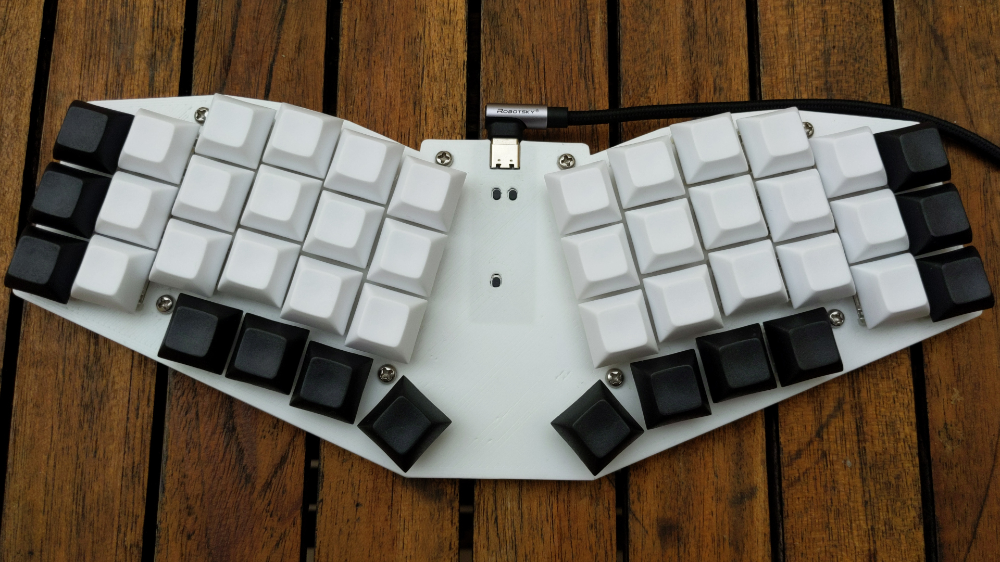

# Unsplitted ergo Keyberon [](https://travis-ci.org/TeXitoi/keyberon-f4)

## Presentation

A handwired unsplitted ergo keyboard. It uses
[keyberon](https://github.com/TeXitoi/keyberon) for its firmware.

The case is totally parametric: you can customize a lot of things, including:
 - number of rows
 - number of columns
 - number of thumb keys
 - angle between the two halves
 - column stagger

## Gallery

### First version


### Second version

The dev board has a dedicated cutout.

6×3+4 layout with a bit more stagger.



### Third version

The "plate" is now thick and play the role of case, with just a flat
sheet for the back.

Default version (6×3+4):


Minimal version, for testing, with
```
nb_cols=2;
nb_rows=2;
nb_thumbs=2;
```


Ferris like version, with
```
deltas=[-d,0,d,0,-5*d];// column stagger
nb_cols=5;
nb_rows=3;
nb_thumbs=2;
```


## Bill of Materials

 - a [WeAct MiniF4 development board](https://www.aliexpress.com/item/1005001456186625.html)
 - a 3D printed [plate](cad/plate.stl)
 - a 3D printed [case](cad/case.stl)
 - 44 [Cherry MX compatible keyboard
   switches](https://www.aliexpress.com/item/32840007937.html) (for
   the default parameters)
 - 44 [Cherry MX compatible 1U
   keycaps](https://www.aliexpress.com/item/32830177884.html) (for the
   default parameters)
 - 44 [1N4148 diodes](https://www.aliexpress.com/item/32660088529.html)
   (for the default parameters)
 - [Polyurethane Enameled Copper Wire 0.2mm](https://www.aliexpress.com/item/1005003388771247.html)
 - 8 [4mm M3 screws](https://www.aliexpress.com/item/32948746653.html)
   (or 9 if you opt for center screw in the parameters)
 - 8 [3mm M3 brass inserts](https://www.aliexpress.com/item/32958273559.html)
   (or 9 if you opt for center screw in the parameters)
 - a [USB-C cable](https://www.aliexpress.com/item/4000624424432.html)
 - a [soldering kit](https://www.aliexpress.com/item/4000019437594.html)

Everything can be found for less than $60 new on Aliexpress without
the case.

## Building

You can follow the [building guide of keyberon
grid](https://github.com/TeXitoi/keyberon-grid/blob/master/BUILDING.md)
or any other handwiring guide. I recommand to read a few to have
different visions.

For the wiring of the dev board, refer to the source code for the pins.

## Compiling

Install the rust toolchain

```shell
curl https://sh.rustup.rs -sSf | sh
rustup target add thumbv7em-none-eabihf
rustup component add llvm-tools-preview
cargo install cargo-binutils
```

Compile the firmware

```shell
cargo objcopy --bin keyberon-f4 --release -- -O binary keyberon.bin
```

## Flashing using DFU

Put the developement board in DFU mode by pushing reset while pushing
boot, and then release boot. Then flash it:
```shell
dfu-util -w -d 0483:df11 -a 0 --dfuse-address 0x08000000:leave -D keyberon.bin
```

The LED on the board should react to caps lock (if you push caps lock
on another keyboard, the light should toggle), and the user button
send space.
